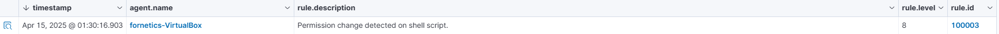

# Laporan Modul 2 OPREC NETICS 

## Instalasi Wazuh Manager
Wazuh manager akan diinstall pada VPS berbasis Ubuntu. Untuk melakukan instalasi lewat terminal di Ubuntu, gunakan `curl` untuk mengambil script instalasi Wazuh. 
```curl -sO https://packages.wazuh.com/4.11/wazuh-install.sh```
Setelah mengambil script, ubah permission script yang telah diambil agar bisa di execute. Setelah itu execute untuk install Wazuh Manager
```chmod +x wazuh-install.sh && ./wazuh-install.sh```


After installing, we can check the dashboard for Wazuh Manager. To get into the dashboard, access the ip of where the Wazuh Server is installed. In this case, the dashboard can be accessed using https://https://46.202.164.2.


Enter credentials that was given during installation, and then the dashboard will be revealed


## Instalasi Wazuh Agent
Wazuh agent akan diinstall pada sebuah Virtual Machine berbasis Linux Mint yang dijalankan pada mesin Windows 11 melewati aplikasi Virtual Box.

Untuk menginstal Wazuh Agent, pertama pindah ke root user, lalu jalankan script yang disediakan oleh Wazuh untuk melakukan install melalui `apt`


Setelah instalasi selesai dilakukan, Wazuh Agent akan otomatis tersambung pada Wazuh Manager yang telah ditetapkan pada variabel `WAZUH_MANAGER` pada saat instalasi.

Untuk cek apakah memang benar telah terhubung, bisa dilihat melalui Wazuh Dashboard


## Custom Rules
Untuk membuat custom rule, modifikasi file `local_rules.xml` yang terletak pada directory `var/ossec/etc/rules`

### Rule 1 Prequisite
Testing untuk FIM akan dilakukan pada sebuah directory spesial bernama `specialdir3` yang terletak pada home. Tambahkan line berikut di Wazuh Agent pada file `/var/ossec/etc/ossec.conf`:
```XML
<ossec_config>
  <syscheck>
    <directories realtime="yes">/specialdir3</directories>
  </syscheck>
</ossec_config>
```
Hal ini dilakukan agar Wazuh Agent dapat mendeteksi kejadian yang ada pada folder tersebut. Apabila tidak ditambahkan, tidak akan ada deteksi yang dapat trip Wazuh Rules.

### Custom Rule 1 (File Permission Update)
```XML
<group name="syscheck">
  <rule id="100002" level="8">
    <if_sid>550</if_sid>
    <field name="changed_fields">permission</field>
    <description>File permission was changed.</description>
    <mitre>
      <id>T1222.002</id>
    </mitre>
  </rule>
</group>
```

Rule ini akan trigger event level 8 ketika sebuah file berubah permission.

Perubahan permission file dapat menjadi indikator adanya upaya eskalasi privilege atau penyamaran file berbahaya. Dengan memonitor perubahan ini, sistem dapat lebih cepat mendeteksi aktivitas mencurigakan yang memodifikasi hak akses file penting.


### Custom Rule 2 (SSH Brute Force Attempt)
```XML
<group name="ossec,syslog,sshd,">
 <rule id="100002" level="5">
   <if_sid>5716,5758,5760,5762,2502</if_sid>
   <match>^Failed|^error: PAM: Authentication|^error: maximum authentication attempts exceeded|Failed password|Failed keyboard|authentication error|Connection reset|more authentication failures;|REPEATED login failures</match>
   <description>SSH Brute Force attack is attempted </description>
   <group>authentication_failed,gdpr_IV_35.7.d,gdpr_IV_32.2,gpg13_7.1,hipaa_164.312.b,nist_800_53_AU.14,nist_800_53_AC.7,pci_dss_10.2.4,pci_dss_10.2.5,tsc_CC6.1,tsc_CC6.8,tsc_CC7.2,tsc_CC7.3,</group>
  </rule>
</group>
```

Rule ini akan trigger event level 5 ketika sebuah brute force attempt terhadap ssh terjadi.

Brute force adalah teknik umum untuk mencoba masuk ke sistem secara tidak sah. Rule ini bertujuan mendeteksi dan memberikan peringatan dini terhadap upaya login berulang yang gagal melalui SSH, yang bisa menjadi tanda serangan.


### Custom Rule 3 (Shell Script Permission Changed)
```XML
<group name="syscheck">
  <rule id="100003" level="8">
    <if_sid>550</if_sid>
    <field name="file">.sh$</field>
    <field name="changed_fields">^permission$</field>
    <description>Permission change detected on shell script.</description>
    <mitre>
      <id>T1222.002</id>
    </mitre>
  </rule>
</group>
```

Rule ini akan trigger event level 8 ketika sebuah file berekstensi `.sh` (shell script) diubah permission nya.

Perubahan permission pada shell script bisa menjadikan script yang sebelumnya tidak bisa dieksekusi menjadi executable, yang dapat digunakan untuk menjalankan perintah berbahaya secara otomatis. Ini penting untuk mendeteksi persistence attack.





### Rule 4-6 Prequisite
Untuk Rule 4, 5, dan 6. Terlebih dahulu konfigurasi file `/var/ossec/etc/ossec.conf` pada Wazuh Agent dengan menambahkan sebagai berikut:
```conf
<ossec_config>
  <syscheck>
    <directories check_all="yes" realtime="yes">/root/.ssh/</directories>
    <directories check_all="yes" realtime="yes">/home/*/.ssh/</directories>
    <directories check_all="yes" realtime="yes">/var/*/.ssh/</directories>
    <directories check_all="yes" realtime="yes">/etc/ssh/sshd_config</directories>
  </syscheck>
</ossec_config>
```
Hal ini dilakukan agar Wazuh Agent dapat memonitor file file yang berada pada semua directory ssh.


### Custom Rule 4 (SSH authorized_keys file is added)
```XML
<group name="common_persistence_techniques,sshd,">
  <rule id="100004" level="10">
    <if_sid>554</if_sid>
    <field name="file" type="pcre2">\/authorized_keys$</field>
    <description>SSH authorized_keys file "$(file)" has been added</description>
    <mitre>
      <id>T1098.004</id>
    </mitre>
  </rule>
```

Rule ini akan trigger event level 10 ketika sebuah authorized_keys ditambahkan pada ssh Wazuh Agent.

Penambahan file `authorized_keys` secara diam-diam bisa menjadi metode attacker untuk mendapatkan akses persistensi ke mesin target tanpa melalui proses otentikasi normal.


### Custom Rule 5 (SSH authorized_keys file is modified)
```XML
  <rule id="100005" level="10">
    <if_sid>550</if_sid>
    <field name="file" type="pcre2">\/authorized_keys$</field>
    <description>SSH authorized_keys file "$(file)" has been modified</description>
    <mitre>
      <id>T1098.004</id>
    </mitre>
  </rule>
```

Rule ini akan trigger event level 10 ketika sebuah authorized_keys yang sudah ada dimodifikasi dalam bentuk apapun pada Wazuh Agent.

Modifikasi pada `authorized_keys` dapat berarti penggantian atau penambahan kunci oleh pihak tidak sah. Ini dapat membuka pintu bagi akses backdoor tanpa sepengetahuan admin.


### Custom Rule 6 (SSH config has been modified)
```XML
  <rule id="100006" level="10">
    <if_sid>550</if_sid>
    <field name="file" type="pcre2">\/sshd_config$</field>
    <description>SSH config file "$(file)" has been modified</description>
    <mitre>
      <id>T1098.004</id>
    </mitre>
  </rule>
```

Rule ini akan trigger event level 10 ketika config dari SSHD telah dimofikasi

File konfigurasi SSH mengatur bagaimana koneksi dilakukan. Modifikasi bisa berarti membuka port baru, mengaktifkan login root, atau hal berbahaya lainnya yang berhubungan dengan remote access.


### Rule 7 Prequisites
Untuk rule 7, konfigurasi file `/var/ossec/etc/ossec.conf` dan tambahkan:
```XML
<ossec_config>
  <syscheck>
    <directories check_all="yes" realtime="yes">/etc/shadow</directories>
    <directories check_all="yes" realtime="yes">/etc/gshadow</directories>
    <directories check_all="yes" realtime="yes">/etc/passwd</directories>
    <directories check_all="yes" realtime="yes">/etc/group</directories>
    <directories check_all="yes" realtime="yes">/etc/login.defs</directories>
  </syscheck>
</ossec_config>
```

### Rule 7 (A Local Account has been Modified)
```XML
<group name="common_persistence_techniques,">
  <rule id="100007" level="10">
    <if_sid>550</if_sid>
    <field name="file" type="pcre2">\/etc\/passwd$|\/etc\/shadow$|\/etc\/gshadow$|\/etc\/group$|\/etc\/login.defs$</field>
    <description>[File "$(file)" has been modified]: Possible local account manipulation</description>
    <mitre>
      <id>T1136.001</id>
      <id>T1078.003</id>
    </mitre>
  </rule>
</group>
```
Rule ini akan trigger event level 10 ketika beberapa folder, mainly `/etc/shadow`, `/etc/gshadow`, `/etc/passwrd`, `/etc/group`, `/etc/login.defs` telah dimodifikasi. 

File seperti `/etc/passwd` dan `/etc/shadow` menyimpan informasi penting terkait user. Modifikasi bisa menjadi tanda pembuatan, perubahan, atau eskalasi akun oleh attacker.


### Rule 8 - 9 Prequisites
Untuk rule 8 - 9, konfigurasi file `/var/ossec/etc/ossec.conf` dan tambahkan:
```XML
<ossec_config>
  <syscheck>
    <directories check_all="yes" realtime="yes">/etc/</directories>
    <directories check_all="yes" realtime="yes">/home/*/.bash_profile</directories>
    <directories check_all="yes" realtime="yes">/home/*/.bash_login</directories>
    <directories check_all="yes" realtime="yes">/home/*/.profile</directories>
    <directories check_all="yes" realtime="yes">/home/*/.bash_profile</directories>
    <directories check_all="yes" realtime="yes">/home/*/.bashrc</directories>
    <directories check_all="yes" realtime="yes">/home/*/.bash_logout</directories>
    <directories check_all="yes" realtime="yes">/root/.bash_profile</directories>
    <directories check_all="yes" realtime="yes">/root/.bash_login</directories>
    <directories check_all="yes" realtime="yes">/root/.profile</directories>
    <directories check_all="yes" realtime="yes">/root/.bash_profile</directories>
    <directories check_all="yes" realtime="yes">/root/.bashrc</directories>
    <directories check_all="yes" realtime="yes">/root/.bash_logout</directories>
  </syscheck>
</ossec_config>
```

### Rule 8 (A Shell Config is Added)
```XML
<group name="common_persistence_techniques,">
  <rule id="100008" level="10">
    <if_sid>554</if_sid>
    <field name="file" type="pcre2">\/etc\/profile$|\/etc/profile.d\/|\/etc\/bash.bashrc$|\/etc\/bash.bash_logout$|.bash_profile$|.bash_login$|.profile$|.bash_profile$|.bashrc$|.bash_logout$</field>
    <description>Unix shell config "$(file)" has been added</description>
    <mitre>
      <id>T1546.004</id>
    </mitre>
  </rule>
```

Rule ini akan trigger ketika sebuah shell autorun config seperti `.bash` atau `.sh` di beberapa folder seperti `/etc/bash.bashrc` telah dibuat.

Shell config baru bisa digunakan untuk menanam perintah yang akan dijalankan saat user login. Ini adalah salah satu metode persistence yang sering digunakan attacker.


### Rule 9 (A Shell Config is Modified)
```XML
  <rule id="100009" level="10">
    <if_sid>550</if_sid>
    <field name="file" type="pcre2">\/etc\/profile$|\/etc/profile.d\/|\/etc\/bash.bashrc$|\/etc\/bash.bash_logout$|.bash_profile$|.bash_login$|.profile$|.bash_profile$|.bashrc$|.bash_logout$</field>
    <description>Unix shell config "$(file)" has been modified</description>
    <mitre>
      <id>T1546.004</id>
    </mitre>
  </rule>
```

Rule ini akan trigger ketika sebuah shell autorun config seperti `.bash` atau `.sh` di beberapa folder seperti `/etc/bash.bashrc` telah dimodifikasi.

Perubahan konfigurasi shell bisa berarti penambahan perintah yang dijalankan otomatis saat shell dibuka. Hal ini sering dilakukan oleh malware untuk persistensi.


### Rule 10-11 Prequisites
Untuk rule 10 - 11, konfigurasi file `/var/ossec/etc/ossec.conf` dan tambahkan:
```XML
<ossec_config>
  <syscheck>
    <directories check_all="yes" realtime="yes">/etc/systemd/system/</directories>
    <directories check_all="yes" realtime="yes">/usr/lib/systemd/system/</directories>
    <directories check_all="yes" realtime="yes">/usr/local/lib/systemd/system/</directories>
    <directories check_all="yes" realtime="yes">/lib/systemd/system/</directories>
  </syscheck>
</ossec_config>
```

### Rule 10 (System Scheduling is Added)
```XML
  <rule id="100010" level="12">
    <if_sid>554</if_sid>
    <field name="file" type="pcre2">\/systemd\/system\/.*\.timer$|\/systemd\/system\/.*\.service$</field>
    <description>[Systemd "$(file)" has been added]: Possible task/job scheduling</description>
    <mitre>
      <id>T1053.006</id>
    </mitre>
  </rule>
```
Rule ini akan trigger ketika sebuah Scheduled Task ditambahkan melalui systemd timer. File-file yang dimodifikasi biasanya terdapat pada `/etc/systemd/system/`, `/usr/lib/systemd/system/`, `/usr/local/lib/systemd/system/`, dan `/lib/systemd/system/`.

Menambahkan service atau timer baru melalui systemd dapat menjadi cara attacker menjadwalkan script berbahaya agar dijalankan otomatis (persistence mechanism).


### Rule 11 (System Scheduling is Modified)
```XML
  <rule id="100011" level="12">
    <if_sid>550</if_sid>
    <field name="file" type="pcre2">\/systemd\/system\/.*\.timer$|\/systemd\/system\/.*\.service$</field>
    <description>[Systemd "$(file)" has been modified]: Possible task/job scheduling</description>
    <mitre>
      <id>T1053.006</id>
    </mitre>
  </rule>
```

Rule ini akan trigger ketika sebuah Scheduled Task dimodifikasi melalui systemd timer. File-file yang dimodifikasi biasanya terdapat pada `/etc/systemd/system/`, `/usr/lib/systemd/system/`, `/usr/local/lib/systemd/system/`, dan `/lib/systemd/system/`.

Modifikasi terhadap systemd timer atau service bisa menjadi tanda bahwa attacker mengubah waktu eksekusi tugas berbahaya, atau mengganti executable-nya.


